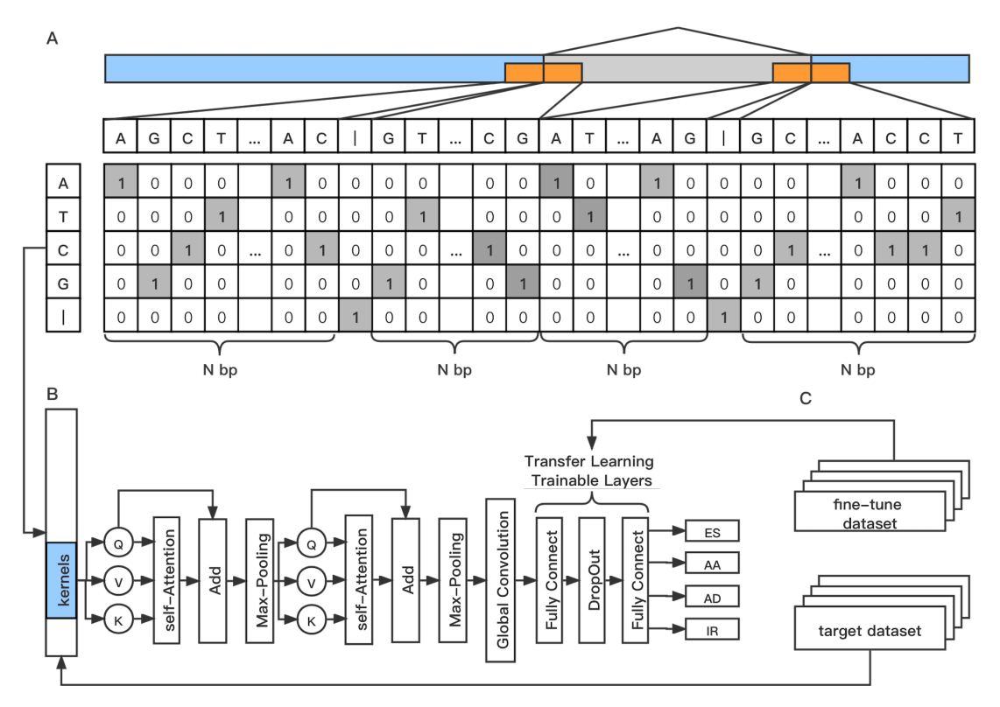

# DeepASmRNA: Reference-free prediction of alternative splicing events with a scalable and interpretable deep learning model 
The sharp increase in the number of sequenced transcriptomes without reference genomes has empowered the investigation of AS events. We proposed an attention-based CNN model, DeepASmRNA, an accurate, scalable and biologically interpretable tool for predicting AS events using a transcriptome without a reference genome, which is a step towards investigating AS genome-wide in species without a reference genome. To our knowledge, DeepASmRNA is the first only dependence of primary sequences of mRNA transcripts for predicting AS at the genome-wide level. DeepASmRNA will greatly expand the studies of alternative splicing in species without a reference genome.

Our method, DeepASmRNA, is composed of two parts. For the first part, we use all-versus-all BLASTN to identify alternatively spliced transcripts. For the second part, we use an attention-based convolution neural network (CNN) approach to classify 4 basic types of AS: exon skipping (ES), alternative acceptor site (AA), alternative donor site (AD) and intron retention (IR). Our model takes the primary sequence of transcripts without a reference genome as input and outputs the probability of ES, AA, AD and IR for each transcript pair.

##### the workflow of model



## Dependencies:

1. Python 3.5–3.8
2. TensorFlow >2.1
3. blastn 2.10.1

We strongly recommend using Anaconda to install all dependencies. You can simply install the dependencies by running following commands.

```bash
conda create -n DeepASmRNA python=3.7
conda activate DeepASmRNA
conda install tensorflow=2.1
conda install biopython
```

## Installation:

After testing all dependencies works well, you can git clone it into your working directory, and all executable file placed in bin/

```bash
git clone https://github.com/CMB-BNU/DeepASmRNA.git
cd DeepASmRNA/bin
chmod 777 identifier.sh
echo "export PATH=`pwd`:\$PATH" >>~/.bashrc && source ~/.bashrc
```


## Running:

#### first way: for overall workflow
```bash
sh identifier.sh transcript.fasta model ### For model, choosing from [arabidopsis, rice, human], arabidopsis or rice for plant, human for animal
```


#### second way: step by step

#### 1). predict AS event
For predict AS event:

```bash
makeblastdb -in transcript.fasta -dbtype nucl    ### make blast database 
blastn -query transcript.fasta -db transcript.fasta -strand plus -evalue 1E-10 -outfmt 5 -ungapped -num_threads 20 -out transcript.xml  ### sequence alignment using blastn
python3 predictAS.py transcript.xml  transcript.fasta transcriptas.txt >transcript.seq ### predict AS transcript pair 
```


#### 2). classify AS event

You can run AS classification model by 

```bash
python classifyAS.py transcript.seq \    ### input file name 
-m human \    ### optional, model for species, choosing from [arabidopsis, human, rice, fine_tune], default = human
-o transcriptas_type.txt ### optional, output file name 
```

Also you can use a very small dataset to enhance the performance of model, for example:

```bash
python classfyAS.py PATH/TO/input_file \    ### input file name 
-m human \    ### optional, model for species, choosing from [arabidopsis, human, rice, fine_tune], default = human
-o PATH/TO/input_file \   ### optional, output file name 
-ft PATH/TO/fine_tune_input_file ### optional, fine tune input file
```
Different from 'input' option, the 1st column of fine tune file should be the label of the sequence, choosing from (ES, AA, AD, IR).

If you use -ft option to fine tune the model, the meaning of -m is the basic model you choose to be trained, the original model will not be changed after each time of fine tune learning.

## Output file :
For transcript.fasta as input file

Three output file were obtained:

1> transcriptas.txt about the AS events information which including position, identity, coverage, length 

2> transcriptas.seq about the sequence of AS events which including the AS region and upstream 50 bp and downstream 50 bp

3> transcriptas_type.txt about the type of the AS event and its probability

## Running example

You can run the example by run_example.sh

## Citation:

Please cite: [Cao L, Zhang Q, Song H, Lin K, Pang E. DeepASmRNA: Reference-free prediction of alternative splicing events with a scalable and interpretable deep learning model. iScience. 2022 Oct 14;25(11):105345. doi: 10.1016/j.isci.2022.105345. PMID: 36325068; PMCID: PMC9619290.](https://www.cell.com/iscience/fulltext/S2589-0042(22)01617-0)


